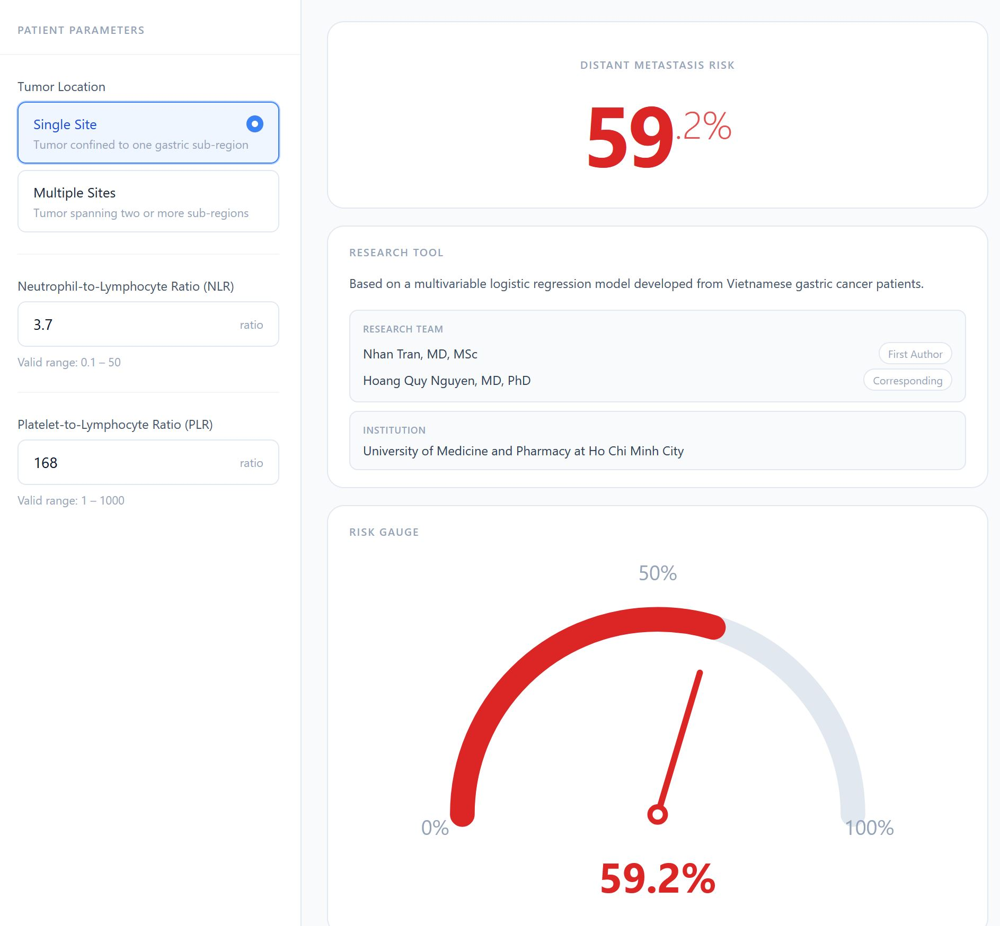
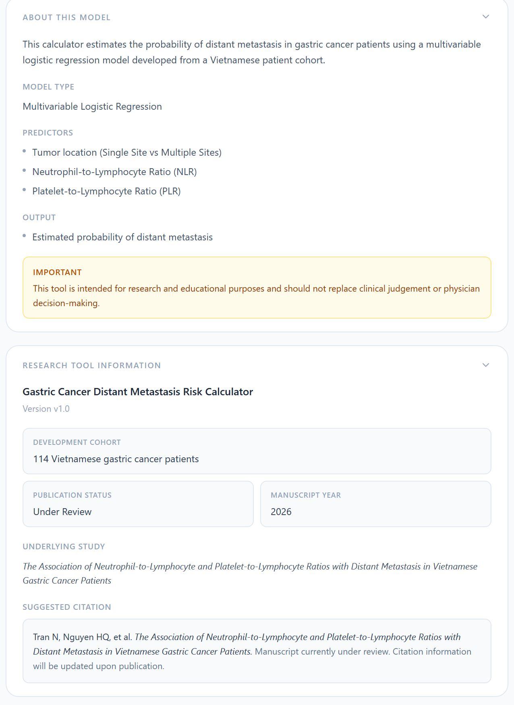
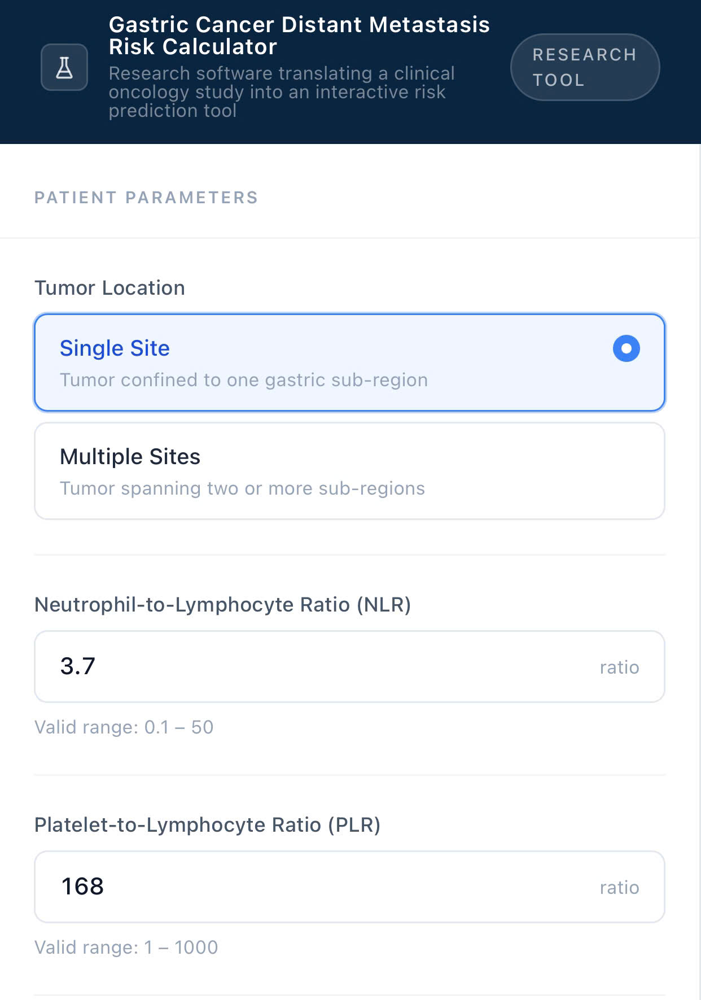
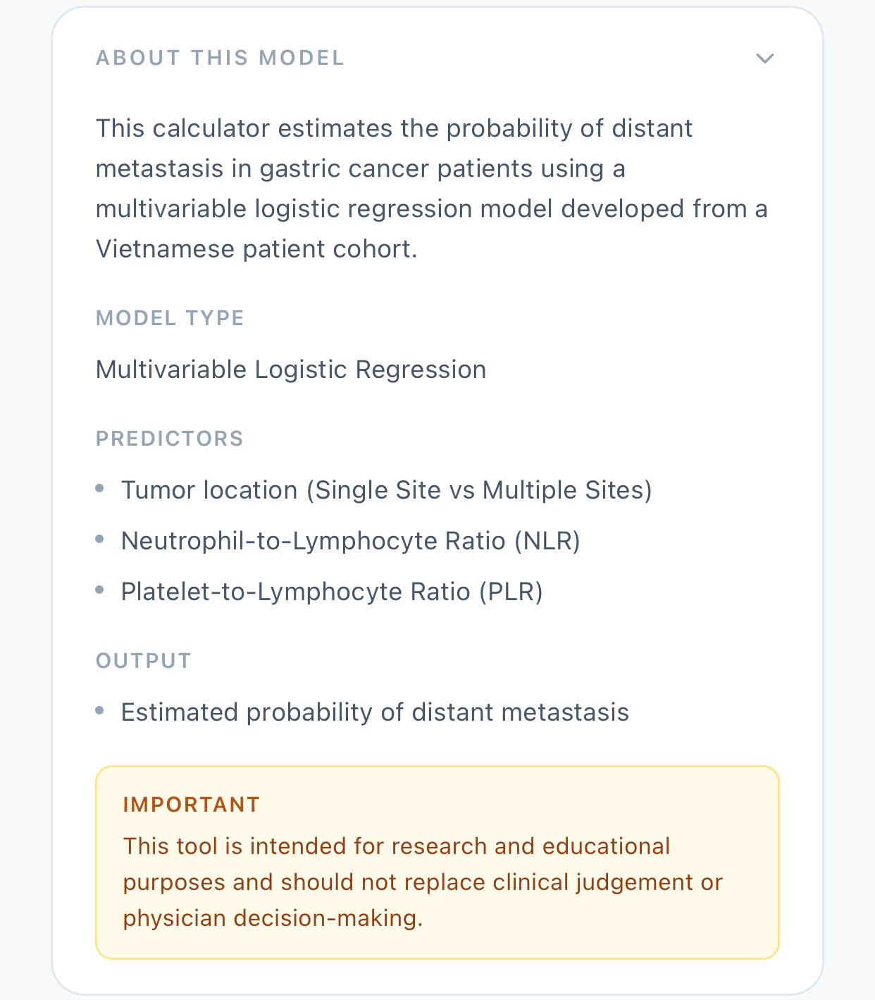

# Gastric Cancer Distant Metastasis Risk Calculator

## Translating Clinical Oncology Research into an Interactive Research Tool

An interactive research tool developed from a Vietnamese gastric cancer cohort to estimate the probability of distant metastasis using a multivariable logistic regression model.

🔗 **Live Demo:** https://gastric-cancer-nomogram.netlify.app/

---

## Clinical Motivation

Distant metastasis is a major determinant of treatment strategy and prognosis in gastric cancer.

However, comprehensive imaging for metastatic assessment may not always be immediately available in resource-constrained healthcare settings.

This project originated from a clinical oncology research question:

> Can routinely available inflammatory biomarkers help identify gastric cancer patients at increased risk of distant metastasis before advanced imaging is performed?

To address this question, we investigated the association of inflammatory biomarkers and metastatic disease in Vietnamese gastric cancer patients and translated the resulting prediction model into an interactive web-based research tool.

---

## Research Background

This tool is based on the study:

**The Association of Neutrophil-to-Lymphocyte and Platelet-to-Lymphocyte Ratios with Distant Metastasis in Vietnamese Gastric Cancer Patients**

### Key Findings

* NLR and PLR increased with disease progression.
* Both biomarkers were associated with distant metastasis in univariate analysis.
* PLR and Tumor Location remained independent predictors in multivariable analysis.
* The combined model demonstrated significant discriminatory performance for identifying distant metastatic disease.
* The model uses routinely available clinical information without requiring additional specialized equipment.

### Clinical Relevance

The model provides a low-cost and accessible approach for initial risk stratification, particularly in environments where advanced imaging resources may be limited.

This study represents one of the first Vietnamese investigations evaluating inflammatory biomarkers for distant metastasis prediction in gastric cancer.

---

## Interactive Research Tool

The calculator estimates distant metastasis probability using:

### Predictors

* Tumor Location

  * Single Site
  * Multiple Sites
* Neutrophil-to-Lymphocyte Ratio (NLR)
* Platelet-to-Lymphocyte Ratio (PLR)

### Output

* Estimated probability of distant metastasis
* Risk visualization
* Predictor contribution analysis
* Risk landscape heatmap

---

## Screenshots

### Desktop Interface



---

### Research Information Panel



---

### Mobile Interface

| Home                             | Information                       |
| -------------------------------- | --------------------------------- |
|  |  |

---

## Development Cohort

| Characteristic | Value                              |
| -------------- | ---------------------------------- |
| Population     | Vietnamese gastric cancer patients |
| Cohort Size    | 114 patients                       |
| Study Design   | Retrospective observational study  |
| Outcome        | Presence of distant metastasis     |

---

## Methodology

### Statistical Approach

* Univariate Logistic Regression
* Multivariable Logistic Regression
* Odds Ratio Estimation
* ROC-based Discrimination Assessment

### Model Inputs

* Tumor Location
* NLR
* PLR

### Model Output

Probability of distant metastasis.

---

## Technology Stack

### Frontend

* React
* TypeScript
* Vite

### Styling

* Tailwind CSS

### Data Visualization

* Custom SVG Risk Gauge
* Heatmap Visualization
* Risk Contribution Panels

### Deployment

* Netlify

### Version Control

* Git
* GitHub

---

## Installation

Clone the repository:

```bash
git clone https://github.com/NhanTran99/Gastric-cancer-metastasis-risk-calculator.git
```

Install dependencies:

```bash
npm install
```

Run locally:

```bash
npm run dev
```

Build production version:

```bash
npm run build
```

---

## Research Team

### First Author

Nhan Tran, MD, MSc

### Corresponding Author

Hoang Quy Nguyen, MD, PhD

### Institution

University of Medicine and Pharmacy at Ho Chi Minh City

---

## Publication Status

**Manuscript Submitted (Under Review)**

Title:

*The Association of Neutrophil-to-Lymphocyte and Platelet-to-Lymphocyte Ratios with Distant Metastasis in Vietnamese Gastric Cancer Patients*

DOI: Pending

---

## Suggested Citation

Tran N, Nguyen HQ, et al.

*The Association of Neutrophil-to-Lymphocyte and Platelet-to-Lymphocyte Ratios with Distant Metastasis in Vietnamese Gastric Cancer Patients.*

Manuscript submitted and currently under review.

Citation information will be updated upon publication.

---

## Research Use Disclaimer

This calculator is intended for research and educational purposes only.

It should not be used as a substitute for clinical judgment, physician decision-making, or guideline-based patient management.

---

## License

MIT License

---

## Project Impact

This project demonstrates a complete translational workflow:

Clinical Question → Clinical Research → Predictive Modeling → Interactive Research Tool → Public Deployment

The objective is to bridge clinical oncology research and practical decision-support technologies, particularly for resource-constrained healthcare environments.